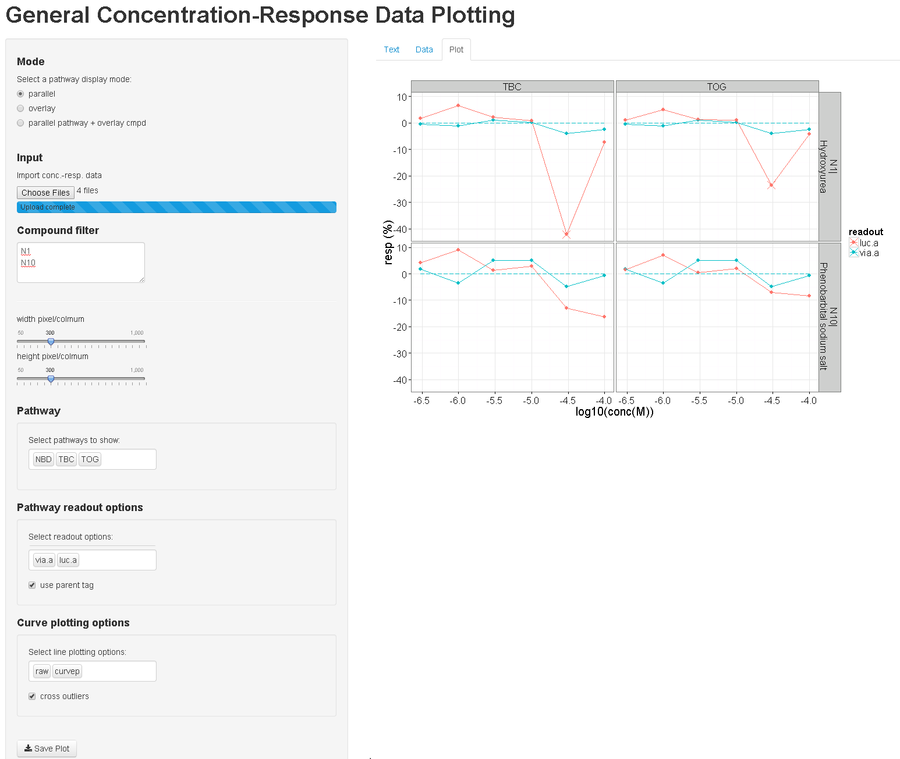

CurveVisualizationGUI
=====================

A R Shiny interface to allow the user to visualize the concentration-response data in a line-point fashion.
User can overlay or parallel pathways based on compounds. Or overlay compounds + parallel pathways. 

Usage
-----
sample files are in the example folder

- download the files in GitHub. 
- extract the zip file in a folder and make the folder as working directory 
- library(shiny)
- runApp()

Input
-----

Tab-delimited files (or RData files) with five sets of required columns:  

- compound identification columns: *Chemical.ID* and *Chemical.Name* columns. This is the basic unit that will be presented as a plot.  
- concentration columns: *conc[0-9]+* columns (e.g., conc0, conc1, conc2, ... etc.)
  - unit: log-transformed concentrations 
- response columns: *resp[0-9]+* columns (e.g., resp0, resp1, resp2, ... etc.)  
  - unit: -100% - 0% - 100%; 0% is the baseline
- pathway column: *pathway* column
- readout column: *readout* column. It is a flexible column. Different readouts will have different colors in the plots. The common format: parent.batch (e.g. luc.1 for TR or BG1ER pathway) and kid.batch (via.1 for TR viability assay)

These five components construct the line-point plots (raw option)

Additional Input
----------------

- chemical identification columns: *CAS*, *Tox21.ID*, *NCGC.ID* columns. 
  - These columns are only used to relate the chemicals to *Chemical.ID*
- parent column: *parent* column
  - It is used to specify the data region that can be used to couple with the parent pathway (e.g., cytotoxicity data can be coupled with many pathways in the high-content assay)
  - The parent pathways are separated using '|' (e.g., SNOU|JAW)
- mask column: *mask* column
  - If *mask* column is empty string, *curvep_mask* is used instead if available.
  - Currently only one mask is allowed.
- curvep result columns (curvep optioin): *curvep_r[0-9]+* columns
- Hill model result columns (hill 4-point option): *Zero.Activity*, *Inf.Activity*, *LogAC50*, *Hill.Coef* columns
- *resp_l[0-9]+* and *resp_h[0-9]* can be used to automatically plot the error bars
- unused columns will be kept. 

